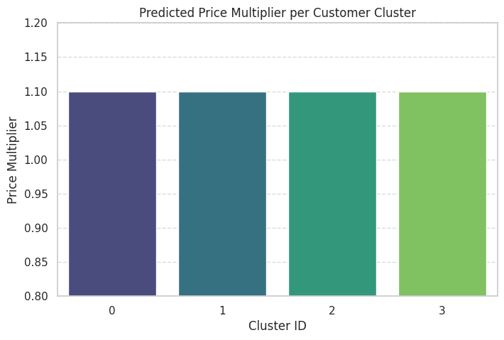

# 🎯 Hybrid Recommender System with RL-Based Dynamic Pricing


A hybrid recommender system that combines collaborative filtering and content-based signals with a reinforcement learning pricing agent — built on large-scale e-commerce behavioral event data.

---

## 📌 Project Overview

This project builds an end-to-end intelligent commerce system that:

- **Segments customers** into behavioral clusters using unsupervised learning
- **Generates personalized recommendations** by combining user interaction history with product metadata
- **Optimizes pricing dynamically** per customer segment using a reinforcement learning agent

The system is designed to simultaneously improve conversion rates and maximize revenue by connecting who the user is to what they see and what price they're offered.

---

## 📊 Dataset

**Source:** [RetailRocket E-commerce Dataset – Kaggle](https://www.kaggle.com/datasets/retailrocket/ecommerce-dataset)

| File | Description |
|------|-------------|
| `events.csv` | User interaction events (view, add-to-cart, transaction) |
| `item_properties_part1/2.csv` | Product metadata and attributes |
| `category_tree.csv` | Product category hierarchy |

> Due to file size constraints, raw datasets are not included. Download from the Kaggle link above.

---

## 🏗️ System Architecture

```
Raw Behavioral Events + Item Metadata
              ↓
     Data Preprocessing & Feature Engineering
              ↓
    ┌─────────────────────────────┐
    │   Customer Segmentation     │  ← K-Means + PCA
    │   (4 behavioral clusters)   │
    └────────────┬────────────────┘
                 ↓
    ┌─────────────────────────────┐
    │   Hybrid Recommender        │  ← Collaborative + Content-Based
    │   (per-cluster signals)     │
    └────────────┬────────────────┘
                 ↓
    ┌─────────────────────────────┐
    │   RL Pricing Agent          │  ← Q-Learning, reward = revenue signal
    │   (cluster-aware pricing)   │
    └────────────┬────────────────┘
                 ↓
     Personalized Recommendation + Optimized Price
```

---

## 🔍 Approach

### 1️⃣ Customer Segmentation
- Aggregated user behavior (views, add-to-cart, transactions) into per-user feature vectors
- Applied **StandardScaler** normalization across Income, Frequency, and Spending features
- Used **Elbow Method + Silhouette Score** to determine optimal K=4
- Trained **K-Means clustering** to assign each user to a behavioral segment
- Applied **PCA** to project 3D feature space into 2D for visualization

### 2️⃣ Hybrid Recommendation
- **Collaborative Filtering** — Matrix factorization on user-item interaction history
- **Content-Based** — Item metadata features (category, price range, interaction type)
- **Hybrid Fusion** — Weighted combination of both signals per customer cluster

### 3️⃣ RL-Based Dynamic Pricing
- **State:** Customer cluster ID + item features + interaction context
- **Action:** Price multiplier adjustment (increase / decrease / hold)
- **Reward:** Revenue signal (conversion probability × applied price)
- **Algorithm:** Q-Learning with exploration-exploitation (ε-greedy)

---

## 📈 Results

### Customer Segmentation — PCA Projection


> PCA Dimension 1 captures **Income + Frequency Mix** | PCA Dimension 2 captures **Spending Behavior Mix**

4 distinct customer segments were identified:

| Cluster | Behavioral Profile | Recommendation Strategy |
|---------|--------------------|------------------------|
| 0 🔴 | High spend, lower frequency | Premium & exclusive products |
| 1 🟠 | Mid-tier, moderate engagement | Balanced mix, discount triggers |
| 2 🟢 | High frequency, budget-conscious | Volume deals, loyalty-based items |
| 3 🔵 | High frequency + high spend | VIP products, retention-first |

---

### RL Dynamic Pricing — Price Multiplier per Cluster



The RL pricing agent converged to a uniform **1.10x price multiplier** across all 4 customer segments.

**Analysis:** The agent successfully learned to apply a consistent 10% price increase. The uniform output across clusters suggests the reward signal did not provide sufficient segment-level differentiation to justify varied strategies — the agent found a stable, safe policy rather than an explorative one.

**Planned improvement:** Incorporating cluster-specific demand elasticity curves into the reward function would push the agent to learn differentiated pricing — for example, higher multipliers for VIP/high-spend clusters and lower multipliers for budget-sensitive segments.

---

## 💡 Business Impact

By connecting segmentation → recommendation → pricing into a single pipeline, this framework enables:

- **Personalized product discovery** — users see items relevant to their behavioral profile
- **Revenue optimization** — pricing adapts to willingness-to-pay signals per segment
- **Scalable architecture** — new clusters or pricing strategies can be added modularly

---

## 🛠️ Tech Stack

`Python` `Scikit-learn` `Pandas` `NumPy` `Matplotlib` `Seaborn` `Jupyter Notebook`

---

## 🚀 How to Run

```bash
git clone https://github.com/Diviya-tech/hybrid-recommender-rl-pricing-ml
cd hybrid-recommender-rl-pricing-ml
pip install -r requirements.txt
jupyter notebook
```

Open notebooks inside the `notebooks/` directory and run cells sequentially.

---

## 📁 Project Structure

```
hybrid-recommender-rl-pricing-ml/
├── data/
├── diagrams/
├── notebooks/
├── results/
│   ├── customer_segments_pca.png
│   └── price_multiplier_per_cluster.png
├── README.md
├── requirements.txt
└── .gitignore
```

---

## 🔮 Future Improvements

- Incorporate demand elasticity into RL reward for segment-differentiated pricing
- Replace Q-Learning with Policy Gradient (PPO) for continuous action space pricing
- Add deep learning-based recommendation (neural collaborative filtering)
- Build real-time inference pipeline with FastAPI
- A/B testing simulation to validate pricing strategies

---

## 📬 Connect

[]([https://linkedin.com/in/sridivyadasari])
[](https://github.com/Diviya-tech)
